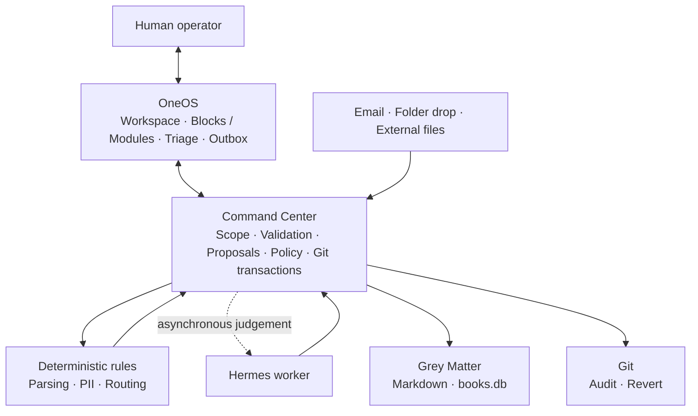

# OneOS Product Thesis

**Status:** frozen product direction

**Updated:** 2026-08-07

This document explains **why OneOS exists and what problem it must solve**.
`AGENTS.md` remains authoritative for implementation constraints, `BUILD.md`
for the build loop, and the vault's `oneos-spec.md` for phase order. This
thesis does not authorize features outside the current phase.

## Why this exists

The problem is not a lack of places to store files. It is the repeated mental
work required after information arrives: identify it, understand it, decide
where it belongs, reorganize it, and later prove what happened to it.

Ordinary file systems and note applications leave those decisions to the
human. Agents can reduce the effort, but direct autonomous access creates a
trust problem. OneOS exists to make information actionable without surrendering
ownership or control:

> The system understands scattered information, proposes organized actions in
> batches, and executes only what the human approves.

## Product position

OneOS is not another notes application, bulk-file warehouse, CRM, or general
workflow builder. Its useful distinction is the combination of:

- local ownership through portable Markdown, SQLite, and Git;
- one registry-driven structure across multiple isolated entities;
- a vault that reflects external information without requiring everything to
  be relocated into it;
- deterministic processing where possible and propose-only agent judgement;
- one human approval gate for consequential actions; and
- revertible changes with source-level provenance.

The claim that no comparable full product exists is a market hypothesis, not a
design invariant. Individual competitors already provide agents, document
workflows, audit logs, or flexible schemas. OneOS must prove its value through
the integrated local-first control model and measurable reduction in daily
decision effort—not through competitor feature counts.

## System layers and working names

The working names describe separate responsibilities and should not be
collapsed into one generic "brain" product:

- **OneOS** is the complete system.
- **OneOS** is the human surface for reading, triage, review, approval,
  and operation.
- **Command Center** is the deterministic orchestration and control boundary
  inside OneOS. It owns scope, policy, proposal coordination, and approved
  transactions.
- **Grey Matter** is the private vault and system of record.
- **Hermes** is an asynchronous worker for schedules, delivery, and judgement.
  It proposes actions; it is neither the orchestrator nor approval authority.

The OneOS workspace switcher selects an entity or saved scope. Within that
scope, **Blocks / Modules** are two views of the same registry-backed data:
blocks group work by purpose, while modules show the actual vault structure.
The selected scope's main canvas is the Command Center screen.

The Command Center begins as an internal FastAPI service boundary, not another
daemon or deployment unit. It may coordinate deterministic rules and Hermes,
but no model call or external service call enters the web request path.

`OneBrain` is not used as the working name because it collapses the store,
worker, orchestrator, and human surface into one ambiguous role. `Grey Matter`
remains the vault name rather than the web product name. Public brand naming,
domain selection, and trademark screening are deferred until the usage gates
prove a product worth naming externally.

## Core workflow

The heart of the product is deliberately narrow:

1. Information arrives through a shared, privacy-filtered intake envelope.
2. Ingestion writes only the redacted Markdown receipt to the inbox and creates
   one isolated `ingest:` commit. Raw source content remains outside the vault.
3. Deterministic rules extract what they can; uncertain judgement produces a
   destination proposal, confidence, and alternatives.
4. Repetitive items are grouped into a reviewable batch.
5. The human approves, corrects, or rejects the batch in the outbox.
6. Approval performs exactly the reviewed operations in one isolated,
   revertible commit while preserving per-item provenance.
7. Corrections improve future rules; unsupported confidence causes abstention,
   not silent filing.

File residence follows the four patterns defined in `AGENTS.md`: working,
shared, data-carrier, and knowledge-carrier. The vault is the working brain,
not the bulk-file warehouse. Migration remains read-only until placement is
approved, then uses copy, SHA-256 verification, and quarantine—never
move-and-delete.

## Foundations still required

These are genuine foundations for the core workflow, not optional feature
expansion:

1. **Stable identity:** every managed item needs an immutable identifier that
   survives moves and renames. Paths are locations, not identities.
2. **Lifecycle and idempotency:** legal state transitions—from discovery and
   proposal through archive, quarantine, or disposal—must be explicit. Repeating
   an operation must not duplicate files, events, or extracted rows.
3. **Transactional batches:** approval must detect stale sources, affect only
   reviewed paths, and either complete fully or leave a recoverable state.
4. **Measured classification:** confidence and accuracy must be evaluated on
   real labelled intake. Rule execution can be deterministic; model judgement
   remains a versioned proposal and may abstain.
5. **Reconciliation, security, and recovery:** external links and catalog
   records require read-only health checks. Sensitive narrative and tabular
   data need access controls, tested backup/restore, and auditable retention.

A hash chain stored only in the database it protects is not independently
tamper-evident. If compliance-grade evidence becomes necessary, chain tips must
be signed and anchored outside that database under a defined threat model.

## Explicit deferrals

Do not build a visual workflow designer, broad workflow engine, complete
acknowledgement suite, universal typed-schema system, SaaS packaging,
auto-replanning, or a large catalogue of agent skills until the intake loop
proves the need. Email routing, retention, and audit-event expansion must also
preserve the same envelope, outbox, scope, and revert guarantees.

## Proof of value

The product earns expansion when real use demonstrates:

- less time and fewer decisions to clear a representative inbox;
- measured destination acceptance and correction rates;
- no cross-entity or unapproved content changes;
- one isolated, revertible commit per approved action or batch;
- every extracted fact resolving to its source; and
- inventory reconciliation accounting for every migrated item.

Changes to this thesis should be driven by measured use or an explicit product
decision, and reconciled with `AGENTS.md`, `BUILD.md`, and the authoritative
vault conventions in the same change.
